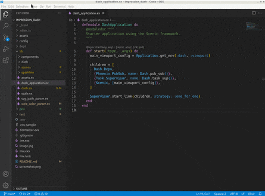

# ElixirLS: Elixir support and debugger for VS Code
[](github/actions/workflow/status/elixir-lsp/vscode-elixir-ls/main.yml?branch=master)
[](https://marketplace.visualstudio.com/items?itemName=JakeBecker.elixir-ls)
[](https://open-vsx.org/extension/elixir-lsp/elixir-ls)
[](https://elixir-lang.slack.com/archives/C7D272G6N)

Provides Elixir language server and debug adapter. This extension is powered by the [Elixir Language Server (ElixirLS)](https://github.com/elixir-lsp/elixir-ls), an Elixir implementation of Microsoft's IDE-agnostic [Language Server Protocol](https://microsoft.github.io/language-server-protocol/) and [Debug Adapter Protocol](https://microsoft.github.io/debug-adapter-protocol/). Visit its page for more information. For a guide to debugger usage in Elixir, read [this blog post](https://medium.com/@JakeBeckerCode/debugging-elixir-in-vs-code-400e21814614).

Features include:

- Code completion
- Debugger support [VSCode debugging docs](https://code.visualstudio.com/docs/editor/debugging)
- Test discovery, running and debugging via Test Explorer [VSCode test API announcement](https://code.visualstudio.com/updates/v1_59#_testing-apis)
- Automatic, incremental Dialyzer analysis
- Automatic suggestion for @spec annotations based on Dialyzer's inferred success typings
- Diagnostic reporting of build warnings and errors
- Go-to-definition and Go-to-implementation
- Task provider with collection of mix tasks [VSCode tasks](https://code.visualstudio.com/docs/editor/tasks)
- Smart automatic closing of code blocks
- Documentation lookup on hover
- Function signature provider
- Code formatter (Triggered by `Alt + Shift + F` hotkey or enabling `editor.formatOnSave`)
- Find references to functions and modules
- Document and Workspace symbols provider
- Multi-root workspaces


## This is the main vscode-elixir-ls repo

The [elixir-lsp](https://github.com/elixir-lsp)/[vscode-elixir-ls](https://github.com/elixir-lsp/vscode-elixir-ls) repo began as a fork when the original repo at [JakeBecker](https://github.com/JakeBecker)/[vscode-elixir-ls](https://github.com/JakeBecker/vscode-elixir-ls) became inactive for an extended period of time. So we decided to start an active fork to merge dormant PRs and fix issues where possible. We also believe in an open and shared governance model to share the work instead of relying on one person to shoulder the whole burden.

The original repository has now been deprecated in favor of this one. Future updates to the original [VS Code ElixirLS extension](https://marketplace.visualstudio.com/items?itemName=JakeBecker.elixir-ls) will come from this repo.

## Default settings

ElixirLS is opinionated and sets the following default settings for Elixir files:

```jsonc
{
  // Based on Elixir formatter's style
  "editor.insertSpaces": true,
  // Note: While it is possible to override this in your VSCode configuration, the Elixir Formatter
  // does not support a configurable tab size, so if you override this then you should not use the
  // formatter.
  "editor.tabSize": 2,
  "files.trimTrailingWhitespace": true,
  "files.insertFinalNewline": true,
  "files.trimFinalNewlines": true,

  // Provides smart completion for "do" and "fn ->" blocks. Does not run the Elixir formatter.
  "editor.formatOnType": true,

  // Misc
  "editor.wordBasedSuggestions": false,
  "editor.trimAutoWhitespace": false
}
```

You can, of course, change these in your user settings, or on a per project basis in `.vscode/settings.json`.

## Advanced Configuration

### Customizing launch config for test runner

The test runner builds a launch configuration dynamically basing on hardcoded default values:

```js
{
  "type": "mix_task",
  "name": "mix test",
  "request": "launch",
  "task": "test",
  "env": {
    "MIX_ENV": "test",
  },
  "taskArgs": buildTestCommandArgs(args, debug),
  "startApps": true,
  "projectDir": args.cwd,
  // we need to require all test helpers and only the file we need to test
  // mix test runs tests in all required files even if they do not match
  // given path:line
  "requireFiles": [
    "test/**/test_helper.exs",
    "apps/*/test/**/test_helper.exs",
    args.filePath,
  ],
  "noDebug": !debug,
}
```

The default launch config can be customized by providing a project launch configuration named `mix test`. If found, this launch config is used as the default for running and debugging tests.

Example:

```json
{
  "type": "mix_task",
  "name": "mix test",
  "request": "launch",
  "debugAutoInterpretAllModules": false,
  "debugInterpretModulesPatterns": ["MyApp*"]
}
```

### Add support for emmet

`emmet` is a plugin that makes it easier to write HTML: https://code.visualstudio.com/docs/editor/emmet

Open VSCode and hit Ctrl+Shift+P (or Cmd+Shift+P) and type "Preference: Open Settings (JSON)"
Add or edit your `emmet.includedLanguages` to include the new Language ID:

```json
"emmet.includeLanguages": {
  "html-eex": "html"
}
```

## Supported versions

See [ElixirLS](https://github.com/elixir-lsp/elixir-ls) for details on the supported Elixir and Erlang versions.

## Using ElixirLS with Dev Containers

You can run ElixirLS inside a [VS Code dev container](https://code.visualstudio.com/docs/devcontainers/containers) for a consistent development environment. An example configuration is provided in the [elixir-ls-devcontainer-example](https://github.com/elixir-lsp/elixir-ls-devcontainer-example/blob/main/.devcontainer/Dockerfile) repository. Copy its `.devcontainer` folder into your project (or use it as a starting point), then select **Remote-Containers: Reopen in Container** from the command palette. After the container builds, the extension will run in the container just as it does locally.

## Troubleshooting

If you run into issues with the extension, try these debugging steps:

- Make sure you have `hex` and `git` installed.
- Make sure `github.com` and `hex.pm` are accessible. You may need to configure your HTTPS proxy. If your setup uses TLS man-in-the-middle inspection, you may need to set `HEX_UNSAFE_HTTPS=1`.
- If ElixirLS fails to start, you can try cleaning the `Mix.install` directory. (The location on your system can be obtained by calling `Path.join(Mix.Utils.mix_cache(), "installs")` from an `iex` session.)
- Restart ElixirLS with a custom command `restart`
- Run `mix clean` or `mix clean --deps` in ElixirLS with the custom command `mixClean`.
- Restart your editor (which will restart ElixirLS).
- After stopping your editor, remove the entire `.elixir_ls` directory, then restart your editor.
  - NOTE: This will cause you to have to re-run the entire dialyzer build

You may need to set `elixirLS.mixEnv`, `elixirLS.mixTarget`, `elixirLS.projectDir` and/or `elixirLS.useCurrentRootFolderAsProjectDir` if your project requires it. By default, ElixirLS compiles code with `MIX_ENV=test`, `MIX_TARGET=host`, and assumes that `mix.exs` is located in the workspace root directory.

If you get an error like the following immediately on startup:

```
[Warn  - 1:56:04 PM] ** (exit) exited in: GenServer.call(ElixirLS.LanguageServer.JsonRpc, {:packet, %{...snip...}}, 5000)
    ** (EXIT) no process: the process is not alive or there's no process currently associated with the given name, possibly because its application isn't started
```

and you installed Elixir and Erlang from the Erlang Solutions repository, you may not have a full installation of Erlang. This can be solved with `sudo apt-get install esl-erlang`. (This was originally reported in [#208](https://github.com/elixir-lsp/elixir-ls/issues/208)).

On fedora if you only install the elixir package you will not have a full erlang installation, this can be fixed by running `sudo dnf install erlang` (This was reported in [#231](https://github.com/elixir-lsp/elixir-ls/issues/231)).

### Check ElixirLS Output

Check the output log by opening `View > Output` and selecting "ElixirLS" in the dropdown.



### Check the Developer Tools

Check the developer console by opening `Help > Toggle Developer Tools` and include any errors that look relevant.

## Contributing

This project consists of two main components that can be developed independently:

1. **VS Code Extension** (TypeScript) - Client-side functionality, UI integration, and language client management
2. **ElixirLS Language Server** (Elixir) - Core language features, LSP/DAP implementation

### Extension Development Setup

For developing the VS Code extension itself (TypeScript code, commands, UI features):

```shell
# Clone this repo recursively to ensure you get the elixir-ls submodule
git clone --recursive git@github.com:elixir-lsp/vscode-elixir-ls.git

# Install extension dependencies
cd vscode-elixir-ls
npm install

# Install ElixirLS dependencies (required for testing)
cd elixir-ls
mix deps.get
MIX_ENV=prod mix compile
cd ..
```

**Development workflow for extension changes:**

```shell
# Watch TypeScript changes (recommended)
npm run watch

# Launch development extension (press F5 or use command below)
# This opens a new VS Code window with your extension loaded
code --extensionDevelopmentPath=.
```

**Testing extension changes:**

```shell
# Run extension tests
npm test

# On Linux (requires display server)
xvfb-run -a npm test

# Alternative test script
./test.sh  # or test.bat on Windows
```

### ElixirLS Language Server Development

For developing the language server itself (Elixir code, LSP features, diagnostics):

**Important:** Set `ELS_LOCAL=1` to use your local ElixirLS source instead of the bundled release.

```shell
# Development mode - use local ElixirLS source
export ELS_LOCAL=1

# Launch extension with local ElixirLS
code --extensionDevelopmentPath=. /path/to/test/elixir/project
```

**Development workflow for ElixirLS changes:**

```shell
# 1. Make changes to ElixirLS code in elixir-ls/apps/
# 2. Compile changes
cd elixir-ls
MIX_ENV=prod mix compile

# 3. Restart VS Code window to pick up changes
# Or use "Developer: Reload Window" command
```

**Testing ElixirLS changes:**

```shell
cd elixir-ls

# Run all ElixirLS tests
mix test

# Test specific app
cd apps/language_server && mix test

# Test specific file/line
mix test test/language_server/providers/completion_test.exs:42
```

### Packaging and Distribution

Build and install the extension locally:

```shell
# Build the extension package
npx vsce package

# Install locally
code --install-extension *.vsix --force
```

**Note:** If you have the marketplace extension installed, you may need to disable [Extensions: Auto Check Updates](https://code.visualstudio.com/docs/editor/extension-gallery#_extension-autoupdate) to prevent your local version from being replaced.

### Contributing to ElixirLS (Language Server)

The ElixirLS language server is included as a Git submodule in the `elixir-ls` folder. This allows you to develop and test changes to both components simultaneously.

**When to contribute to ElixirLS:**

- Adding new language features (completion, diagnostics, formatting)
- Fixing LSP/DAP protocol implementation
- Improving performance or memory usage
- Adding support for new Elixir/OTP versions

**ElixirLS development workflow:**

```shell
# Enter the submodule directory
cd vscode-elixir-ls/elixir-ls

# Create your feature branch
git checkout -b my_new_branch

# Make changes to language server code in apps/language_server/
# or debug adapter code in apps/debug_adapter/

# Test your changes with local development mode
cd ..
export ELS_LOCAL=1
code --extensionDevelopmentPath=. /path/to/test/project
```

**Contributing ElixirLS changes back:**

```shell
# Fork the ElixirLS repo and add as remote
cd elixir-ls
git remote add my_fork git@github.com:<your_github_username>/elixir-ls.git

# Commit and push your changes
git commit -m "Add new language feature"
git push my_fork my_new_branch

# Create PR at https://github.com/elixir-lsp/elixir-ls/compare
```

**Important:** ElixirLS changes should be contributed to the [ElixirLS repository](https://github.com/elixir-lsp/elixir-ls), while extension changes go to this repository.

### Running Tests

**Extension tests:**

```shell
rm -rf out
npm run compile
npm test
```

**ElixirLS tests:**

```shell
cd elixir-ls
mix test

# Test specific components
cd apps/language_server && mix test
cd apps/debug_adapter && mix test
```

## Telemetry

This extension collects telemetry information emitted by ElixirLS language server and debug adapter for feature insight and performance and health monitoring. Collected telemetry data include usage, performance, environment info and error reports. Data is anonymised and not personally identifiable. Data is sent to Azure Application Insights via [@vscode/extension-telemetry](https://www.npmjs.com/package/@vscode/extension-telemetry). The extension respects VSCode `telemetry.telemetryLevel` setting. For transparency [telemetry.json](telemetry.json) details all collected information. If you would like inspect what is being collected or change your telemetry settings, please refer to [VSCode Telemetry documentation](https://code.visualstudio.com/docs/getstarted/telemetry).

## Acknowledgements and related projects

There is another VS Code extension for Elixir, [VSCode Elixir](https://github.com/fr1zle/vscode-elixir). It's powered by [Elixir Sense](https://github.com/msaraiva/elixir_sense), another language "smartness" server similar to ElixirLS. Much of this extension's client code (such as syntax highlighting) was copied directly from VSCode Elixir, for which they deserve all the credit.
