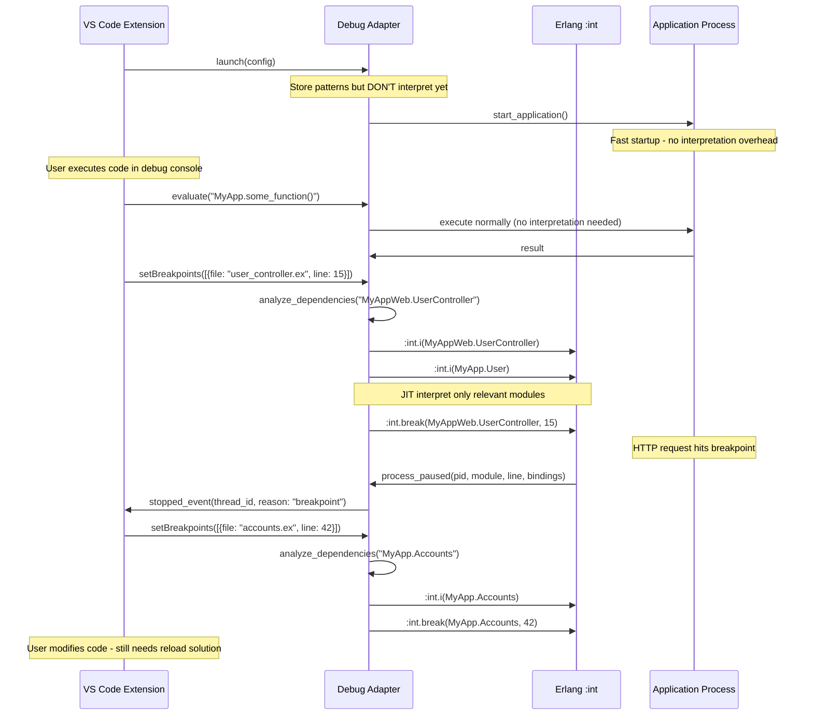

# Technical Spec: Incremental Code Reload During ElixirLS Debug Sessions

## Scenario Definition

### User Workflow

A developer wants to debug their Phoenix application with specific module boundaries and iterate on code changes without losing debugging context.

**Initial Configuration:**

```json
{
  "type": "mix_task",
  "name": "debug phoenix",
  "request": "launch", 
  "task": "phx.server",
  "debugAutoInterpretAllModules": false,
  "debugInterpretModulesPatterns": ["MyApp.*", "MyAppWeb.*"],
  "excludeModules": [":cowboy", ":ecto"]
}
```

**User Journey:**

1. Start debug session → ~50 modules interpreted in MyApp.*and MyAppWeb.* namespaces
2. Set breakpoint in `MyAppWeb.UserController.show/2`
3. Navigate to `/users/123` in browser → hits breakpoint
4. Explore state: `user = %User{id: 123, name: "Alice"}`, `conn.params = %{"id" => "123"}`
5. **Modify code**: Add validation logic to `MyApp.Accounts.get_user!/1`
6. **Want to**: Reload modified code and continue debugging without losing current context

### Alternative Scenario: Just-In-Time (JIT) Interpretation

A more efficient approach where interpretation happens on-demand:

**Enhanced User Journey:**

1. Start debug session with patterns configured but **no modules pre-interpreted**
2. Application starts at normal speed (no interpretation overhead)
3. Use debug console to execute code, examine values, read logs
4. **Set first breakpoint** in `MyAppWeb.UserController.show/2`
5. Debug adapter **detects breakpoint location**, analyzes dependency graph
6. **Interprets only relevant modules** for that breakpoint (e.g., UserController + dependencies)
7. Navigate to `/users/123` → hits breakpoint immediately
8. **Set additional breakpoint** in `MyApp.Accounts.get_user!/1`
9. Debug adapter **incrementally interprets** only new modules needed
10. Continue debugging with minimal interpretation overhead

**JIT Benefits:**

- Fast startup (no pre-interpretation)
- Minimal memory footprint (interpret only what's needed)
- Dynamic expansion of debugging scope
- Preserve full application performance until breakpoints are set

### Current Pain Points

- Must restart entire debug session to reload code changes
- Lose application state (HTTP server, database connections, caches)
- Lose debugging context (current breakpoint, variable bindings)
- Re-interpretation of all 50 modules takes 3-8 seconds (even when most are unused)
- Must manually recreate application state to reach the same debugging point
- **Unnecessary interpretation overhead** when debugging scope is unknown upfront

---

## Current Architecture Analysis

### Component Interaction Flow



### Key Components

#### 1. VS Code Extension (`src/debugAdapter.ts`)

**Responsibilities:**

- Spawns debug adapter process with configuration
- Forwards DAP requests/responses between VS Code and debug adapter
- Manages debug session lifecycle

**Current Limitations:**

- No mechanism to reload code during active session
- Configuration is static after session start
- **Pre-interprets all matching modules regardless of actual debugging needs**

#### 2. Debug Adapter (`elixir-ls/apps/debug_adapter/lib/debug_adapter/server.ex`)

**Responsibilities:**

- Parses `debugInterpretModulesPatterns` into regex patterns
- Uses `:code.all_available()` to find matching modules
- Calls `:int.i(module)` for each matched module (currently all at once)
- Manages breakpoints via `:int.break/2`
- Handles DAP protocol communication

**Current State Management:**

```elixir
defmodule DebugAdapter.Server do
  defstruct [
    # Static configuration - set at launch
    :interpret_modules_patterns,
    :exclude_modules_patterns,
    
    # Runtime state
    :breakpoints,           # %{file_path => [line_numbers]}
    :paused_processes,      # %{pid => process_info}
    :interpreted_modules    # [module_names] - static after launch
  ]
end
```

**JIT Enhancement Opportunity:**

- Track which modules are actually interpreted vs. available for interpretation
- Interpret modules on-demand when breakpoints are set
- Use dependency analysis to determine minimal interpretation set

#### 3. Erlang Interpreter (`:int` module)

**Responsibilities:**

- Maintains interpreted module code (separate from normal BEAM code)
- Tracks breakpoints per module/line
- Pauses processes at breakpoints
- Provides variable bindings for paused processes

**State Isolation:**

- Interpreted modules run different code path than compiled modules
- Breakpoints only work in interpreted modules
- Process state is maintained per-process, not per-module

#### 4. Application Processes

**Current Behavior:**

- Phoenix server process maintains HTTP connections, router state
- GenServer processes maintain internal state
- Database connections and pools persist
- **All state lost on debug session restart**
- **Performance impact from unnecessary module interpretation**

---

## Proposed Dual Architecture: JIT + Incremental Reload

### Scenario 1: Just-In-Time (JIT) Module Interpretation

**Goal:** Only interpret modules when breakpoints are actually set.

#### New Component: JIT Interpretation Manager

```elixir
defmodule DebugAdapter.JitInterpretationManager do
  @moduledoc """
  Manages on-demand module interpretation when breakpoints are set.
  """
  
  defstruct [
    :interpretation_patterns,     # Configured patterns for eligible modules
    :interpreted_modules,        # Currently interpreted modules  
    :eligible_modules,          # Modules matching patterns (cached)
    :breakpoint_modules         # Map of breakpoints to required modules
  ]
  
  def interpret_for_breakpoint(file_path, line, current_state) do
    # 1. Determine module from file path
    # 2. Use LlmModuleDependencies to find required dependencies
    # 3. Interpret only necessary modules
    # 4. Set breakpoint
  end
end
```

### Scenario 2: Incremental Code Reload

### New Component: Code Reload Manager

```elixir
defmodule DebugAdapter.CodeReloadManager do
  @moduledoc """
  Manages incremental code reloading during debug sessions without losing
  application or debugging context.
  """
  
  defstruct [
    :interpreted_modules,        # Current set of interpreted modules
    :module_dependencies,        # Cached dependency graph
    :pending_reloads,           # Modules that need reloading
    :preserved_state            # Application state to preserve
  ]
end
```

### Enhanced Debug Adapter State

```elixir
defmodule DebugAdapter.Server do
  defstruct [
    # Static configuration
    :interpret_modules_patterns,
    :exclude_modules_patterns,
    
    # Enhanced runtime state  
    :breakpoints,
    :paused_processes,
    :interpreted_modules,
    
    # JIT interpretation state
    :jit_manager,              # JitInterpretationManager instance
    :eligible_modules,         # Cached modules matching patterns
    
    # Incremental reload state
    :code_reload_manager,      # CodeReloadManager instance
    :file_watcher,             # FileSystem watcher for code changes
    :last_compilation_time     # Track when modules were last compiled
  ]
end
```

### Integration Points

#### 1. Smart Breakpoint Handling

```elixir
# Enhanced breakpoint setting with JIT interpretation
def handle_request(set_breakpoints_req(_, %{"source" => source, "breakpoints" => breakpoints}), state) do
  file_path = source["path"]
  
  # Determine if this file needs interpretation
  case needs_interpretation?(file_path, state) do
    true ->
      # JIT interpret necessary modules
      {modules_to_interpret, updated_state} = 
        JitInterpretationManager.interpret_for_breakpoint(file_path, breakpoints, state)
      
      # Set breakpoints after interpretation
      set_breakpoints_after_interpretation(modules_to_interpret, breakpoints, updated_state)
      
    false ->
      # File already interpreted or outside scope
      set_breakpoints_normally(breakpoints, state)
  end
end
```

#### 2. Dependency Analysis Integration

```elixir
# Leverage existing LlmModuleDependencies functionality for both scenarios
defmodule DebugAdapter.DependencyAnalyzer do
  alias ElixirLS.LanguageServer.Providers.ExecuteCommand.LlmModuleDependencies
  
  def modules_for_breakpoint(file_path, line) do
    # Determine module from file path
    # Use dependency analysis to find required modules for debugging
    # Return minimal set for JIT interpretation
  end
  
  def modules_affected_by_change(changed_file, current_interpreted) do
    # Use existing dependency analysis to find affected modules
    # Return minimal set of modules that need reinterpretation
  end
end
```

#### 3. File System Monitoring

```elixir
# Monitor source files for changes (for incremental reload)
defmodule DebugAdapter.FileWatcher do
  def watch_patterns(patterns, callback) do
    # Watch .ex files matching interpreted patterns
    # Notify when files change for reload scenarios
  end
end
```

#### 3. State Preservation Strategy

```elixir
defmodule DebugAdapter.StatePreserver do
  def preserve_application_state(interpreted_modules) do
    # Identify critical application processes (Phoenix, GenServers)
    # Snapshot their state before reinterpretation
  end
  
  def restore_application_state(preserved_state) do
    # Restore critical process state after reinterpretation
  end
end
```

---

## Architectural Exploration: Lessons Learned

During the initial exploration of this feature, we encountered significant architectural challenges that informed the final design. These difficulties highlight the complexities of working within the ElixirLS umbrella application structure.

### Challenge: Cross-Application Code Sharing and Visibility

**Initial Approach:** We attempted to implement dependency analysis directly within the debug adapter to enable JIT interpretation.

**Problems Encountered:**

#### 1. Dependency Analysis Isolation

- The `LlmModuleDependencies` module was tightly coupled to the language server application
- Tracer data collection (`Tracer.get_trace()`) was only available within language server context
- Debug adapter had no direct access to the comprehensive module dependency analysis

#### 2. Code Duplication vs. Shared Utilities

- Initially considered duplicating dependency analysis logic in debug adapter
- This would have violated DRY principles and created maintenance overhead
- Realized the need for shared utilities in `elixir_ls_utils` application

#### 3. Test Organization Complexity

- Tests for shared functionality were initially placed in the wrong application
- Cross-application dependencies required careful consideration of test placement
- Example: Tests for `ModuleDependencyAnalyzer` belonged in `elixir_ls_utils`, not `debug_adapter`

### Challenge: Umbrella Application Boundaries

**ElixirLS Structure:**

```
elixir-ls/
├── apps/
│   ├── language_server/     # LSP protocol, code analysis, LLM tools
│   ├── debug_adapter/       # DAP protocol, breakpoint management
│   └── elixir_ls_utils/     # Shared utilities (minimal)
```

**Boundary Issues Identified:**

#### 1. Feature Ownership Ambiguity

- Dependency analysis logically fits in language server (code intelligence)
- JIT interpretation logically fits in debug adapter (debugging functionality)
- Neither application could efficiently implement the complete feature alone

#### 2. Data Access Patterns

- Language server maintains tracer data for code analysis
- Debug adapter needs dependency information for interpretation decisions
- No established pattern for debug adapter to request analysis from language server

#### 3. Protocol Isolation

- Language server communicates via LSP (JSON-RPC over stdio)
- Debug adapter communicates via DAP (separate JSON-RPC over stdio)
- No direct inter-application communication mechanism within umbrella

### Architectural Solutions Discovered

#### 1. Shared Utility Extraction

**Solution:** Extract core dependency analysis into `elixir_ls_utils`

```elixir
# Before: Tightly coupled in language server
defmodule ElixirLS.LanguageServer.Providers.ExecuteCommand.LlmModuleDependencies do
  # All dependency analysis logic embedded here
end

# After: Shared utilities approach
defmodule ElixirLS.Utils.ModuleDependencyAnalyzer do
  # Core analysis logic - reusable across applications
end

defmodule ElixirLS.Utils.ModuleDependencyFormatter do
  # Output formatting - reusable across applications  
end
```

**Benefits:**

- Single source of truth for dependency analysis
- Reusable across language server, debug adapter, and future applications
- Proper separation of concerns

#### 2. Application-Specific Wrappers

**Solution:** Each application provides its own interface to shared utilities

```elixir
# Language server wrapper (existing LLM command)
defmodule ElixirLS.LanguageServer.Providers.ExecuteCommand.LlmModuleDependencies do
  alias ElixirLS.Utils.ModuleDependencyAnalyzer
  
  def execute([module_name], state) do
    trace = get_trace_data(state)  # Language server has tracer access
    ModuleDependencyAnalyzer.get_module_dependencies(module_name, trace)
  end
end

# Debug adapter wrapper (new JIT functionality)
defmodule ElixirLS.DebugAdapter.JitInterpreter do
  alias ElixirLS.Utils.ModuleDependencyAnalyzer
  
  def calculate_interpretation_scope(module_name, trace_data) do
    ModuleDependencyAnalyzer.get_direct_dependencies(module_name, trace_data)
  end
end
```

#### 3. Data Flow Coordination Challenge

**Remaining Problem:** Debug adapter still needs access to tracer data

**Options Explored:**

1. **Direct Access (Not Feasible):**
   - Debug adapter cannot directly access language server's tracer data
   - Different process spaces, no shared state

2. **Tracer Duplication (Inefficient):**
   - Debug adapter could maintain its own tracer
   - Would duplicate memory usage and processing overhead

3. **IDE Extension Coordination (Recommended):**
   - VS Code extension acts as coordinator between applications
   - Language server provides dependency analysis via LSP commands
   - Debug adapter receives processed results via DAP requests

### Testing Implications

#### Cross-Application Test Strategy

- **Utility Tests:** Comprehensive testing in `elixir_ls_utils` with mock data
- **Integration Tests:** Application-specific tests verify wrapper functionality
- **End-to-End Tests:** VS Code extension tests verify full workflow

#### Test Data Management

- Shared test fixtures for dependency analysis scenarios
- Application-specific test data for protocol integration
- Mock tracer data for isolated utility testing

### Performance Considerations Discovered

#### Memory Usage Patterns

- Tracer data can be substantial (hundreds of modules, thousands of function calls)
- Shared utilities must be memory-efficient to avoid duplication
- Caching strategies needed for repeated dependency analysis

#### Computation Complexity

- Dependency analysis is computationally expensive
- Results should be cached and reused across breakpoint operations
- Background processing may be necessary for large codebases

### Final Architecture Decision

**Conclusion:** The complexity of cross-application coordination led to the **IDE Extension Coordinator** approach documented in the companion specification (`02 - ide-coordinator-spec.md`).

**Key Insights:**

1. **Umbrella applications should maintain clear boundaries** - avoid complex inter-application dependencies
2. **Shared utilities are essential** - extract common functionality to avoid duplication
3. **External coordination is sometimes simpler** - VS Code extension coordination avoids complex internal protocols
4. **Test organization matters** - proper test placement prevents confusion and maintenance issues

These architectural lessons informed the final design that leverages the VS Code extension as an intelligent coordinator, maintaining clean separation of concerns while enabling sophisticated debugging features.

---

## Technical Challenges & Solutions

### Challenge 1: JIT Interpretation Timing

**Problem:** Interpreting modules when breakpoints are set may cause delay
**Solution:** Pre-analyze dependency graph and cache results; interpret in background

### Challenge 2: Process State Continuity (Incremental Reload)

**Problem:** Reinterpreting modules affects running processes
**Solution:** Selective state preservation for critical processes

### Challenge 3: Breakpoint Preservation (Incremental Reload)

**Problem:** `:int.n(module)` removes all breakpoints for that module
**Solution:** Cache breakpoints before reinterpretation, restore after

### Challenge 4: Module Dependency Tracking (Both Scenarios)

**Problem:** Determining minimal set of modules needed for debugging/reloading
**Solution:** Use existing `LlmModuleDependencies` to calculate affected modules

### Challenge 5: Safe Reinterpretation Windows

**Problem:** Can't safely reinterpret while processes are paused in those modules
**Solution:** Queue reloads until safe window, or gracefully handle conflicts

### Challenge 6: JIT Performance vs. Completeness Trade-off

**Problem:** JIT may miss edge cases where uninterpreted code calls interpreted code
**Solution:** Conservative dependency analysis; option to force interpretation of broader scope

---

## Implementation Phases

### Phase 1: JIT Foundation (Immediate Value)

- Modify launch behavior to skip pre-interpretation
- Implement `JitInterpretationManager` for on-demand interpretation
- Enhance breakpoint setting to trigger interpretation
- Use existing `LlmModuleDependencies` for dependency analysis

### Phase 2: Incremental Reload (Iterative Development)

- Add `CodeReloadManager` for tracking interpreted modules
- Implement file change detection and selective reinterpretation
- Add DAP command for manual reload requests
- Preserve breakpoints across reloads

### Phase 3: Advanced Features

- Automatic reload on file save (configurable)
- State preservation for critical application processes
- Enhanced error handling and rollback capabilities
- Performance optimizations and caching

### Phase 4: User Experience Polish

- Smart interpretation scope suggestions
- Debugging context preservation across complex scenarios
- Integration with VS Code's debug console and watch expressions
- Performance metrics and debugging for the debugger itself

---

This technical spec now covers both the JIT interpretation approach (for immediate efficiency gains) and incremental reload functionality (for iterative development workflows), providing a comprehensive solution for modern Elixir debugging needs.
